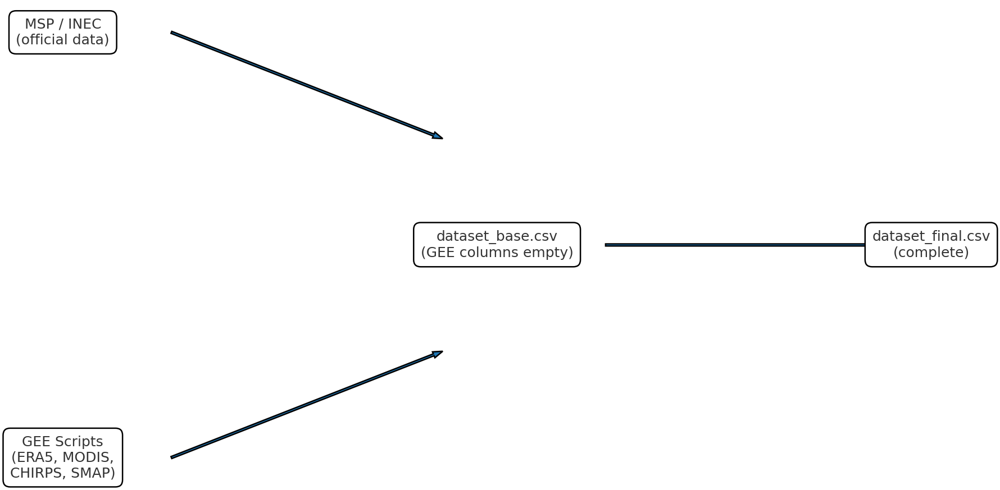
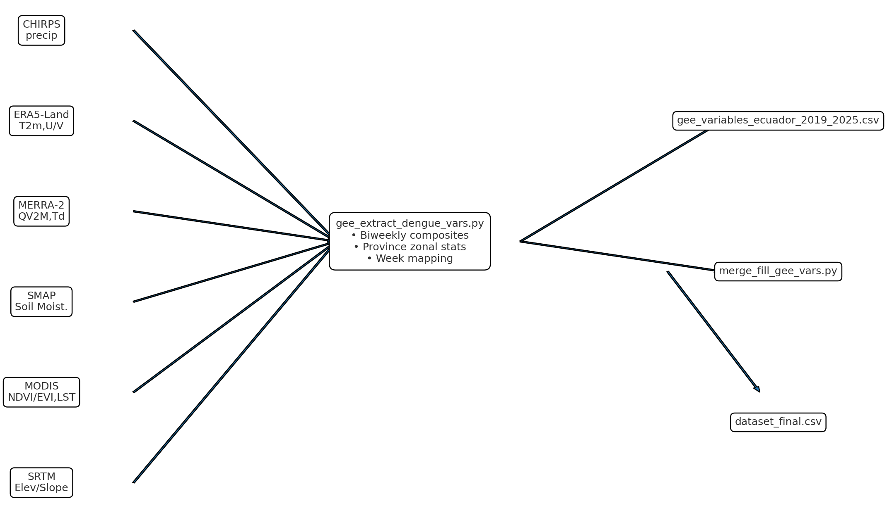

# Predicting dengue outbreaks in Ecuador (2019–2025) / Predicción de brotes de dengue en Ecuador (2019–2025)

**EN:** Machine learning model and reproducible GEE scripts to predict dengue outbreaks by province and epidemiological week in Ecuador.  
**ES:** Modelo de aprendizaje automático y scripts reproducibles de GEE para predecir brotes de dengue por provincia y semana epidemiológica en Ecuador.

---

## Data Flow (Simple) / Flujo de datos (Simple)


**EN:** Official MSP/INEC data + base dataset (with empty GEE columns) → run GEE extractor → merge and fill → final dataset.  
**ES:** Datos oficiales MSP/INEC + dataset base (con columnas GEE vacías) → ejecutar extractor GEE → unir y rellenar → dataset final.

---

## How to Reproduce / Cómo reproducir

### EN
1. Install dependencies:
```bash
pip install earthengine-api pandas
```
2. Extract climate/environmental variables (biweekly → mapped to epi-weeks):
```bash
python scripts/gee_extract_dengue_vars.py
# generates: gee_variables_ecuador_2019_2025.csv
```
3. Merge and fill your base dataset (GEE columns empty/NaN):
```bash
python scripts/merge_fill_gee_vars.py --input data/dataset_base.csv --gee gee_variables_ecuador_2019_2025.csv --out data/dataset_final.csv
```

### ES
1. Instalar dependencias:
```bash
pip install earthengine-api pandas
```
2. Extraer variables climáticas/ambientales (quincenal → asignadas a semanas epi):
```bash
python scripts/gee_extract_dengue_vars.py
# genera: gee_variables_ecuador_2019_2025.csv
```
3. Rellenar tu dataset base (columnas GEE vacías/NaN):
```bash
python scripts/merge_fill_gee_vars.py --input data/dataset_base.csv --gee gee_variables_ecuador_2019_2025.csv --out data/dataset_final.csv
```
---

## Características principales
- **Datos integrados**: combina epidemiología, clima, índices ambientales y factores urbanos.
- **Predicción de riesgo semanal** por provincia.
- **Procesamiento reproducible** gracias al notebook y dataset incluido.
- **Visualización** de resultados y mapas interactivos con Folium.
- **Código modular**: fácil de actualizar o extender con nuevas variables.

---

## Variables

### EN — You may upload (non-GEE):
`anio`, `semana_epi`, `codigo_provincia`, `provincia`,  
`casos_sin_alarma`, `casos_con_alarma`, `casos_graves`, `casos_dengue_total`,  
`hospitalizados`, `fallecidos`, `tasa_incidencia_dengue_x100k`,  
`poblacion_total`, `densidad_poblacional_km2`, `indice_urbanismo`, `acceso_agua_potable`, `escasez_agua`,  
and **your derived features** (lags, seasonality, transforms).

### ES — Puedes subir (no-GEE):
`anio`, `semana_epi`, `codigo_provincia`, `provincia`,  
`casos_sin_alarma`, `casos_con_alarma`, `casos_graves`, `casos_dengue_total`,  
`hospitalizados`, `fallecidos`, `tasa_incidencia_dengue_x100k`,  
`poblacion_total`, `densidad_poblacional_km2`, `indice_urbanismo`, `acceso_agua_potable`, `escasez_agua`,  
y **tus variables derivadas** (lags, estacionalidad, transformaciones).

### EN/ES — GEE variables (do **not** redistribute; fill via the scripts):
`temp_max_c`, `temp_min_c`, `temp_mean_c`, `rango_diurno_temp_dtr`,
`humedad_relativa_pct`, `precipitacion_mm`, `precip_mm`, `spec_hum_gkg`, `dewpt_c`,
`soil_moist_pct`, `elev_m`, `slope_deg`, `indice_viento_m_s`,
`ndvi`, `evi`, `ndwi`, `lst_day_c`, `lst_night_c`, `et_mm`.

---


## Credits & Data Use / Créditos y uso de datos
**EN:** Climate & environmental variables are obtained via **Google Earth Engine (GEE)** from providers such as NASA (MODIS, SMAP), ECMWF (ERA5-Land), CHIRPS, and USGS (SRTM). Epidemiological data from the **Ministerio de Salud Pública del Ecuador (MSP)**. Demographic/socioeconomic data from **INEC**. Original datasets have their own licenses and **are not redistributed** here.  
**ES:** Las variables climáticas y ambientales se obtienen vía **Google Earth Engine (GEE)** de proveedores como NASA (MODIS, SMAP), ECMWF (ERA5-Land), CHIRPS y USGS (SRTM). Datos epidemiológicos del **MSP**. Datos demográficos/socioeconómicos del **INEC**. Los datos originales tienen sus propias licencias y **no se redistribuyen** aquí.

---

## Colaboradores / Collaborators
- Weslei Jahir Salinas Morán — Desarrollo del código y análisis de datos.
- Italo Alex Guamán Conforme — Desarrollo del código y validación de resultados.

---
## License / Licencia
**Code / Código:** MIT (see `LICENSE`).  
**Data / Datos:** Original datasets from GEE & providers keep their own licenses. Do **not** redistribute outside allowed terms.

---

## Citation / Citación

### EN (APA)
Salinas, W. (2025). *Predicting dengue outbreaks in Ecuador (2019–2025)*. GitHub. https://github.com/Wes2024/Predicting_dengue_outbreaks_in_Ecuador.git

### BibTeX
```bibtex
@misc{Predicting_dengue_outbreaks_in_Ecuador,
  author    = {Salinas, Weslei},
  title     = {Predicting dengue outbreaks in Ecuador (2019--2025)},
  year      = {2025},
  publisher = {GitHub},
  howpublished = {\url{https://github.com/usuario/Predicting_dengue_outbreaks_in_Ecuador}}
}
```

> Tip: connect the repo to **Zenodo** to mint a DOI for releases. Then update this section with the DOI.

---

## Technical Diagram (optional) / Diagrama técnico (opcional)

